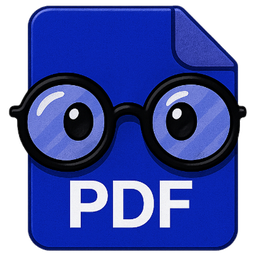
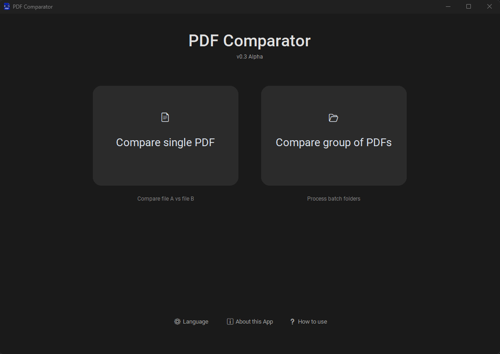
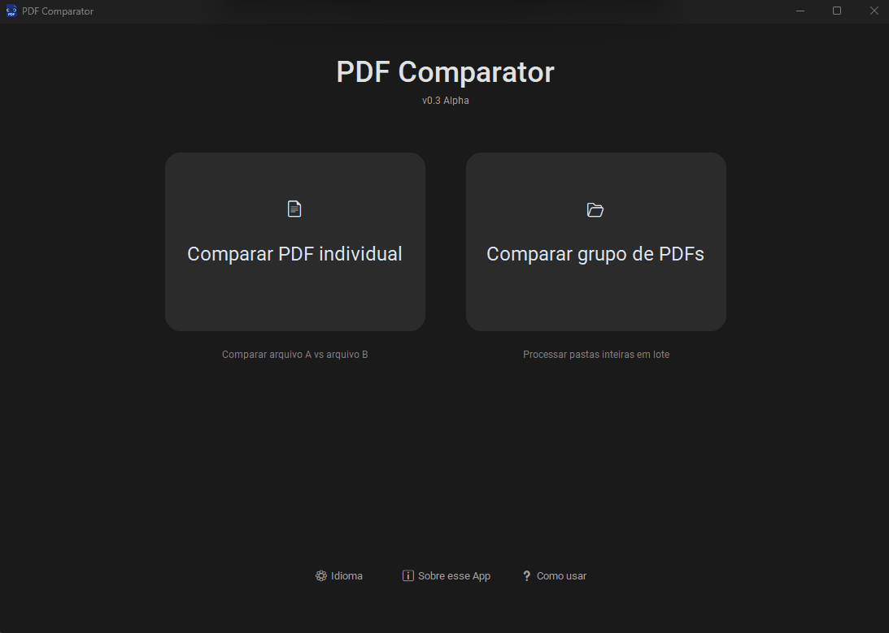
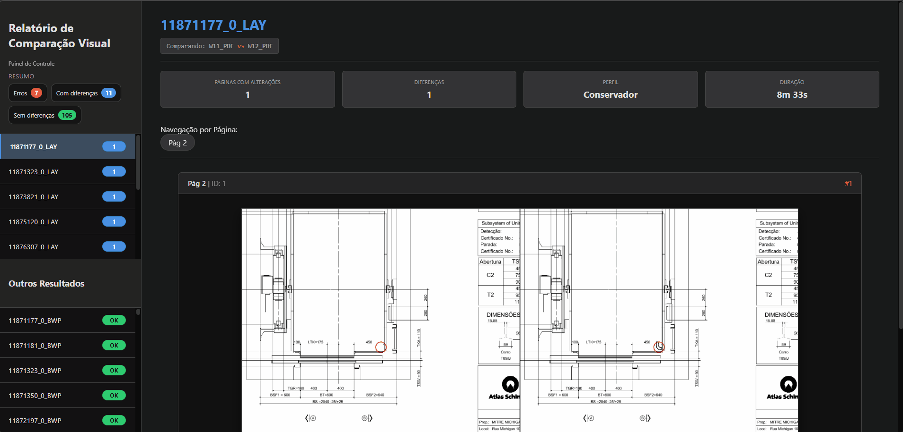
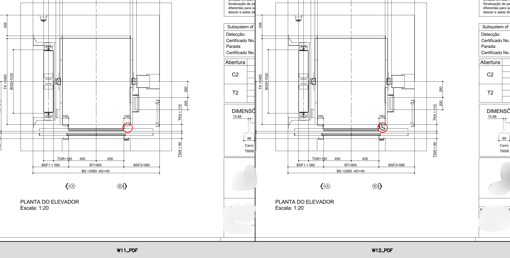

<p align="center">
  
</p>

<h1 align="center">PDF Comparator</h1>

<p align="center">
  <em>Computer Vision & Deep Learning for Engineering Blueprint Analysis</em>
</p>

<p align="center">
  
  
  
  
</p>

<p align="center">
  
  
  
  
</p>

---

## 🚀 Business Impact

> Engineered a Computer Vision solution that reduced engineering blueprint analysis time by **99%** — from **12 hours** to **5 minutes** — while completely eliminating human error in visual inspections.

---

## 📌 Overview

**PDF Comparator** is an automated visual inspection tool built to detect structural and textual discrepancies between complex engineering drawings.

Initiated and independently developed since **September 2025** to solve a critical operational bottleneck, the software processes large batches of high-resolution PDFs, compares them pixel-by-pixel, and generates interactive HTML/JS reports for the engineering team to review.

> ⚠️ **Note:** This repository is a portfolio showcase. Source code and executables are proprietary and not publicly available to ensure corporate data compliance.

---

## ✨ Key Features

| Feature | Description |
|---|---|
| ⚡ **Batch Processing** | Multithreaded via `ThreadPoolExecutor` — processes entire directories concurrently |
| 🧠 **Noise Filtering** | Tesseract OCR filters false positives from text displacement, focusing on structural changes |
| 📊 **Interactive Reports** | Dynamically generated HTML dashboards with custom **Sync Scroll** engine |
| 🎛️ **Sensitivity Profiles** | Built-in presets (Conservative → Extreme) plus custom Min Area and Padding Margin parameters |
| 🖥️ **Modern UI** | Dark-mode desktop app built with `CustomTkinter`, designed for non-technical users |

---

## 🏗️ Architecture & Tech Stack

```
PDF Input
   │
   ▼
┌─────────────────────────────┐
│   Image Processing Engine   │  pdf2image + poppler (vector → raster)
│   OpenCV Pipeline           │  grayscale → diff → threshold → contours
└─────────────┬───────────────┘
              │
              ▼
┌─────────────────────────────┐
│   Text Analysis (OCR)       │  pytesseract — filters moved-but-unchanged text
└─────────────┬───────────────┘
              │
              ▼
┌─────────────────────────────┐
│   Report Generation         │  HTML/CSS/JS injected via Python
│   Desktop Interface         │  CustomTkinter dark-mode GUI
└─────────────────────────────┘
```

### Libraries & Tools

- **`pdf2image`** + **`poppler`** — High-fidelity vector-to-raster PDF conversion
- **`OpenCV (cv2)`** — Grayscale conversion, absolute differencing, binary thresholding, contour detection
- **`pytesseract`** — OCR text extraction to filter non-structural differences
- **`CustomTkinter`** — Modern dark-mode desktop interface
- **Native HTML/CSS/JavaScript`** — Programmatically generated offline inspection reports

---

## 🎬 Visual Showcase

### Desktop Application Interface

  

---

  

---  


---

### Interactive Side-by-Side Report (Sync Scroll)



---

### Visual Evidence Detection



---

## 👤 Author

**Anderson Siqueira Souto** — Apprentice Developer  
[](https://www.linkedin.com/in/anderson-siqueira-souto)
