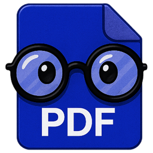
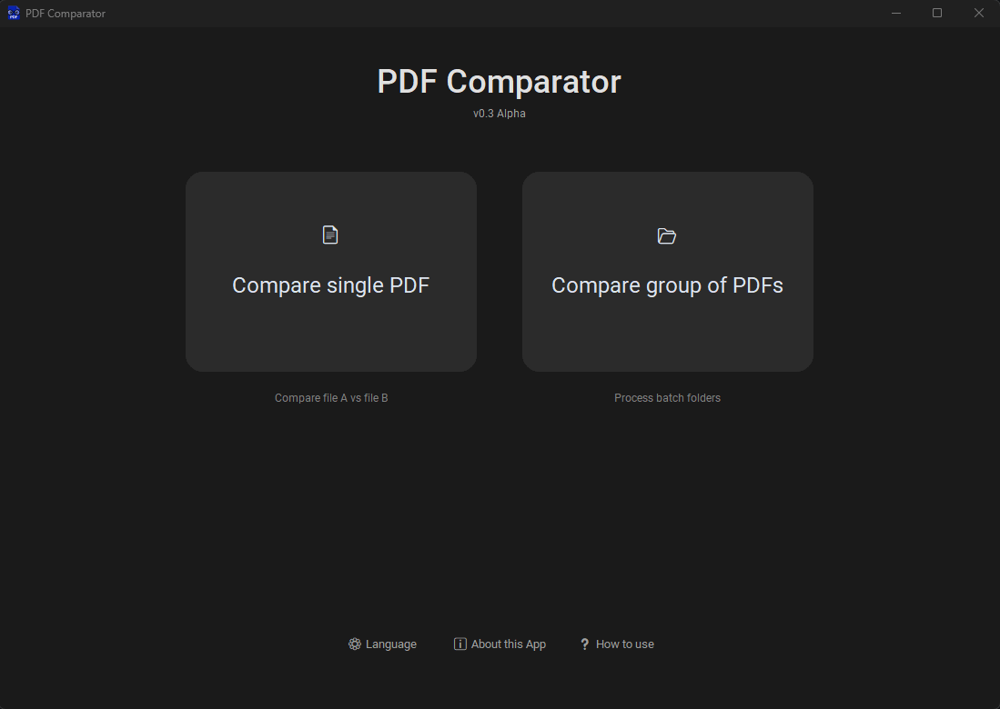
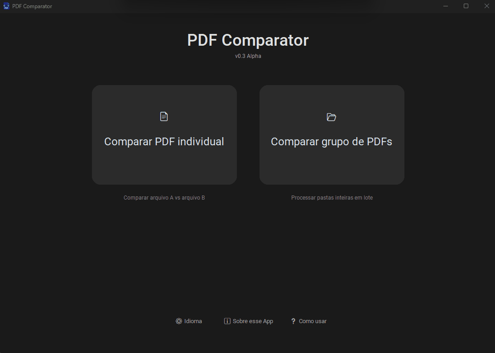
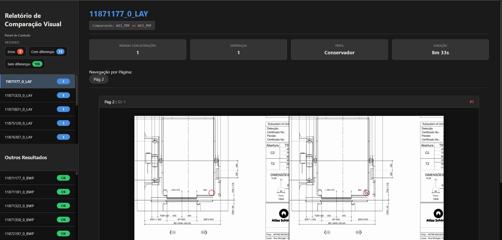
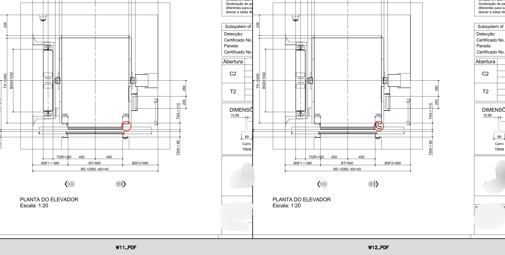

<p align="center">
  
</p>

<h1 align="center">PDF Comparator</h1>

<p align="center">
  <em>Automated comparison of engineering drawings using Python, OpenCV and OCR</em>
</p>

<p align="center">
  
  
  
  
  
</p>

---

## Overview

PDF Comparator is a desktop application I originally developed to automate the comparison of engineering drawings.

The process previously required manually reviewing large PDF files page by page to identify differences between drawing revisions.

The application converts PDF pages into high-resolution images, compares both versions using OpenCV, filters some irrelevant differences with OCR and generates an interactive report for manual validation.

In the original workflow, a comparison that could take around **12 hours manually** could be processed in approximately **5 minutes**, allowing the reviewer to focus directly on the regions where differences were detected.

> **Note:** This repository is a technical showcase only. Production source code, engineering drawings, company templates and internal data are not publicly available.

---

## How it works

```text
Original PDF        Revised PDF
     │                    │
     └─────────┬──────────┘
               │
               ▼
       PDF → Image Conversion
         pdf2image / Poppler
               │
               ▼
         OpenCV Pipeline
    grayscale → diff → threshold
            → contours
               │
               ▼
          OCR Analysis
           Tesseract
               │
               ▼
     Difference Classification
               │
               ▼
       HTML Report Generation
               │
               ▼
        Manual Validation
```

The comparison pipeline detects changed regions between both versions of a drawing and generates visual evidence that can be reviewed through an interactive side-by-side report.

---

## Main Features

| Feature | Description |
|---|---|
| **Batch processing** | Processes multiple documents concurrently using `ThreadPoolExecutor` |
| **Visual comparison** | Detects differences using OpenCV image-processing techniques |
| **OCR filtering** | Uses Tesseract OCR to reduce false positives caused by displaced or unchanged text |
| **Interactive reports** | Generates offline HTML reports with synchronized scrolling between both drawing versions |
| **Sensitivity profiles** | Allows different comparison tolerances depending on the type of drawing |
| **Desktop interface** | Local desktop application built with `CustomTkinter` |
| **Multi-template support** | Supports different engineering drawing layouts through template-specific preprocessing rules |

---

## Multi-template support

The first version of the application was developed around a specific engineering drawing standard.

As the project evolved, I refactored parts of the comparison pipeline so the system would no longer depend entirely on one fixed document layout.

The current architecture can apply different preprocessing and comparison rules depending on the detected or selected document template.

One of these adaptations was created for engineering drawings used at **Elevadores Villarta**, allowing the same comparison engine to work with a different corporate drawing format.

Company templates and their internal processing rules are not included in this repository.

This evolution helped turn the project from a solution designed for one specific workflow into a more reusable document-comparison engine.

---

## Technical Stack

### Image processing

- `OpenCV`
- `pdf2image`
- `Poppler`
- `Pillow`

### Text analysis

- `Tesseract OCR`
- `pytesseract`

### Desktop application

- `Python`
- `CustomTkinter`

### Report generation

- HTML
- CSS
- JavaScript

### Processing

- Python concurrency with `ThreadPoolExecutor`

---

## Comparison Pipeline

A simplified version of the processing flow:

```text
1. Load both PDF versions
2. Convert corresponding pages to images
3. Normalize image dimensions
4. Convert images to grayscale
5. Calculate absolute difference
6. Apply binary threshold
7. Detect difference contours
8. Filter regions by configured sensitivity
9. Analyze text-related differences with OCR
10. Generate visual evidence
11. Build the interactive HTML report
```

The exact production rules and document-specific preprocessing are intentionally omitted.

---

## Visual Showcase

### Desktop Application



---



---


### Interactive Side-by-Side Report

The report keeps both drawing versions synchronized while the reviewer navigates through the document.



### Difference Detection

Detected regions are highlighted so the reviewer can quickly inspect relevant changes.



---

## Background

I started developing PDF Comparator in **September 2025** while working with engineering-document validation.

The original goal was simple: reduce the amount of repetitive manual comparison required when reviewing drawing revisions.

Since then, the project has been improved with OCR filtering, concurrent processing, configurable sensitivity, interactive reports and support for multiple document layouts.

---

## Author

**Anderson Siqueira Souto**

Software Development • Automation • Computer Vision

[](https://www.linkedin.com/in/anderson-siqueira-souto)
